# Diagrama ER — Binance_DB

Diagrama entidad-relación de la base `Binance_DB` (17 entidades del Hito 1 + `DemoUsuarios` de la Clase 2).

```mermaid
erDiagram
    USUARIOS ||--o{ WALLETS : "tiene"
    USUARIOS ||--o{ VERIFICACIONESKYC : "se verifica con"
    USUARIOS ||--o{ CUENTASBANCARIAS : "vincula"
    USUARIOS ||--o{ METODOSPAGO : "habilita"
    USUARIOS ||--o{ SESIONESUSUARIO : "genera"
    USUARIOS ||--o{ NOTIFICACIONES : "recibe"
    USUARIOS ||--o{ ORDENTRADING : "emite"
    USUARIOS ||--o{ ALERTASPRECIO : "configura"
    USUARIOS ||--o{ CARTERASINVERSION : "arma"
    USUARIOS ||--o{ LIMITESTRANSACCION : "tiene"
    USUARIOS ||--o{ AUDITORIAS : "registra acciones de"
    CRIPTOMONEDAS ||--o{ WALLETS : "contiene saldo de"
    CRIPTOMONEDAS ||--o{ HISTORIALPRECIOS : "tiene precios de"
    CRIPTOMONEDAS ||--o{ ALERTASPRECIO : "monitorea"
    WALLETS ||--o{ TRANSACCIONES : "origen"
    WALLETS ||--o{ TRANSACCIONES : "destino"

    USUARIOS {
        int id PK
        varchar email
        varchar nombre_completo
        date fecha_registro
        varchar pais
        varchar estado_verificacion
        varchar documento_identidad
        varchar tipo_documento
        decimal saldo_total_usd
    }

    VERIFICACIONESKYC {
        int id PK
        int usuario_id FK
        varchar nivel
        varchar tipo_documento
        varchar numero_documento
        varchar documento_url
        varchar estado
        date fecha_verificacion
    }

    ROLESPERMISOS {
        int id PK
        varchar nombre_rol
        varchar permiso
        varchar descripcion
        bit activo
    }

    SESIONESUSUARIO {
        bigint id PK
        int usuario_id FK
        varchar dispositivo
        varchar ip_origen
        datetime2 fecha_inicio
        datetime2 fecha_fin
    }

    CRIPTOMONEDAS {
        int id PK
        varchar codigo
        varchar nombre
        int decimales
        varchar red_blockchain
        bit activa_para_trading
    }

    WALLETS {
        int id PK
        int usuario_id FK
        int criptomoneda_id FK
        decimal saldo
        date fecha_creacion
        varchar estado
        varchar direccion_publica
    }

    TRANSACCIONES {
        int id PK
        int wallet_origen_id FK
        int wallet_destino_id FK
        decimal cantidad
        datetime2 fecha_hora
        varchar estado
        varchar hash_transaccion
    }

    CUENTASBANCARIAS {
        int id PK
        int usuario_id FK
        varchar banco
        varchar cbu_iban
        varchar titular
        bit verificada
    }

    METODOSPAGO {
        int id PK
        int usuario_id FK
        varchar tipo
        varchar proveedor
        varchar token_pago
        varchar estado
    }

    ORDENTRADING {
        int id PK
        int usuario_id FK
        varchar par_trading
        varchar tipo_orden
        varchar lado
        decimal cantidad
        varchar estado
    }

    HISTORIALPRECIOS {
        bigint id PK
        int criptomoneda_id FK
        decimal precio_usd
        decimal volumen_24h
        datetime2 fecha_hora
    }

    COMISIONES {
        int id PK
        varchar tipo_operacion
        decimal porcentaje
        decimal monto_fijo
        varchar nivel_usuario
        date vigente_desde
    }

    ALERTASPRECIO {
        int id PK
        int usuario_id FK
        int criptomoneda_id FK
        decimal precio_objetivo
        varchar condicion
        bit activa
    }

    CARTERASINVERSION {
        int id PK
        int usuario_id FK
        varchar nombre
        date fecha_creacion
        decimal valor_total_usd
    }

    LIMITESTRANSACCION {
        int id PK
        int usuario_id FK
        varchar tipo_limite
        decimal monto_maximo
        decimal monto_utilizado
        date fecha_reinicio
    }

    AUDITORIAS {
        bigint id PK
        int usuario_id FK
        varchar entidad_afectada
        varchar accion
        varchar ip_origen
        datetime2 fecha_hora
    }

    NOTIFICACIONES {
        bigint id PK
        int usuario_id FK
        varchar tipo
        varchar mensaje
        bit leida
        datetime2 fecha_envio
    }

    DEMOUSUARIOS {
        int id PK
        varchar email
        varchar pais
        datetime2 fecha_registro
    }
```

## Notas

- **Enlaces directos**: los nombres de relación describen cómo se conecta cada entidad.
- **Independientes** (no tienen FK saliente a otra tabla del modelo): `RolesPermisos`, `Comisiones` y `DemoUsuarios`.
- **Tipo de datos**: `decimal(18,2)` para fiat, `decimal(18,8)` para cripto, `bigint` para entidades de alto volumen.
- Scripts fuente: `sql/01_verificacion_servidor.sql`, `sql/02_demo_indices.sql`, `sql/03_schema_hito1.sql`, `sql/04_seed_datos.sql`.
